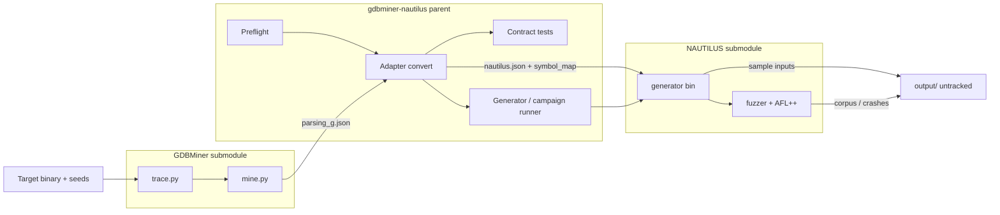
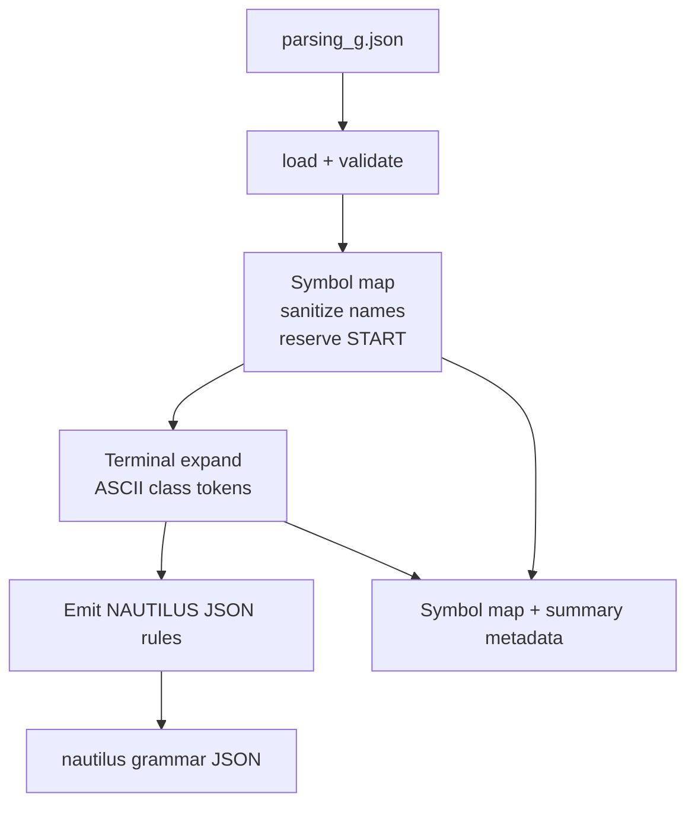

# Architecture: GDBMiner → NAUTILUS adapter

## Problem

Two research tools with incompatible contracts:

| Side | Produces / consumes | Shape |
| ---- | ------------------- | ----- |
| **GDBMiner** | Produces mined grammar | `parsing_g.json`: `{"[start]": "<START>", "[grammar]": {"<NT>": [["tok", …], …], …}}` |
| **NAUTILUS** | Consumes grammar for generation / fuzzing | JSON rules `[[NT, "rhs…"], …]` with root `START`, or Python `ctx.rule` / `ctx.script` / `ctx.regex` |
| **NAUTILUS campaign** | Consumes instrumented binary | AFL++-style `@@` target; workdir corpus layout |
| **GDBMiner eval** | Consumes seeds / traces | INI config + GDB; not reusable as-is for NAUTILUS |

The parent repo owns the seam so neither submodule learns the other's format.

## Target pipeline



## Adapter boundary (ADR-0001)



Responsibilities that **stay in the parent**:

- Symbol sanitization and collision suffixes
- Start-symbol remap to `START`
- ASCII-class / special terminal expansion policy
- Validation (undefined nonterminals, empty rules)
- Preflight (Python, Cargo, submodule pins, generator binary)
- Campaign orchestration and experiment manifests

Responsibilities that **stay in submodules**:

- GDBMiner: tracing, mining, `parsing_g.json` production
- NAUTILUS: tree mutation, coverage, generator binary, AFL++ integration

## Milestone map (thesis narrative)

| Milestone | Thesis question it answers | Claim strength |
| --------- | -------------------------- | -------------- |
| **M1 Adapter core** | Can mined grammars be made consumable by NAUTILUS without hand rewriting? | Interoperability |
| **M2 Generator validation** | Do converted grammars sample non-empty inputs that a target accepts? | Interoperability + smoke validity |
| **M3 Campaign design** | What harness/config would a fair coverage comparison need? | Design only until scoped tickets land |
| **M4 Evaluation slice** (future) | Coverage / precision comparison for one example program | Requires budgets, baselines, repeats |

Do **not** claim improved coverage or bug finding from M1/M2 alone.

## File ownership (future slices)

```text
src/gdbminer_nautilus/
  grammar_adapter.py   # convert API (M1)
  preflight.py         # env checks (M1/M3)
  nautilus_runner.py   # generator wrapper (M2)
  campaign.py          # optional campaign orchestration (M3)
tests/
  fixtures/            # tiny parsing_g.json fixtures
  test_grammar_adapter.py
  test_generator_smoke.py
configs/
  calc.example.toml
```

## Non-goals (for now)

- Vendoring either submodule's source into the parent
- Committing evaluation corpora or traces
- Python `ctx.script` semantic rules (future backend; ADR-0001 keeps JSON first)
- Long fuzzing campaigns as CI
- Claiming better coverage/bug-finding from convert+sample alone (see ADR-0001 non-claims)
